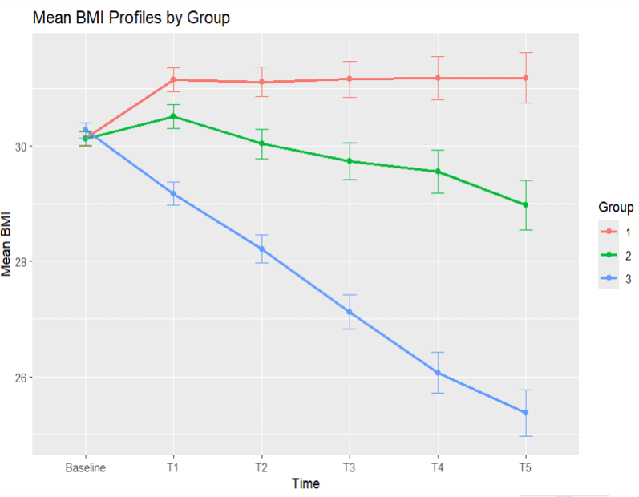

# Linear Mixed Models: Longitudinal BMI Analysis

## Overview

This project applies **linear mixed-effects models (LMMs)** to analyze longitudinal BMI measurements from approximately 1,000 overweight students in Belgium.

The objective is to evaluate how BMI evolves over one academic year under three different prevention approaches, while accounting for baseline characteristics and the correlation between repeated observations from the same student.

The analysis was conducted in **R** using `nlme`, `emmeans`, `tidyverse`, and `gt`.

---

## Research Question

> **How does BMI change over time under each prevention approach, after adjusting for baseline characteristics?**

The study compares three prevention approaches:

1. **Approach 1:** Information booklet on healthy lifestyle and overweight prevention.
2. **Approach 2:** Information sessions, booklets, and sports activity discounts.
3. **Approach 3:** Approach 2 combined with a health coaching application providing tracking and guidance.

BMI was measured repeatedly for each student at:

- Baseline
- T1
- T2
- T3
- T4
- T5

Because repeated observations from the same student are correlated, a **linear mixed-effects model** was used instead of ordinary linear regression.

---

## Data Structure

The original dataset contains repeated BMI measurements in **wide format**. For the longitudinal analysis, the data were transformed into **long format**.

### Main variables

| Variable | Description |
|---|---|
| `ID` | Student identifier |
| `GROUP` | Prevention approach (1–3) |
| `GENDER` | Gender |
| `SMOKE` | Smoking status |
| `LIVE` | Physical activity |
| `BMIb` | Baseline BMI |
| `BMI_T1`–`BMI_T5` | BMI measurements during follow-up |

### Wide format

Each student has one row with BMI measurements at different time points:

```text
ID | GROUP | BMIb | BMI_T1 | BMI_T2 | BMI_T3 | BMI_T4 | BMI_T5
```

### Long format

For the mixed-effects analysis, the data were reshaped to:

```text
ID | GROUP | Time | BMI
```

This format allows the repeated measurements to be explicitly modelled within each student.

---

## Exploratory Analysis

Before fitting the mixed-effects model, mean BMI trajectories were examined across the three prevention groups.



### Observations

The descriptive trajectories suggest substantial differences in BMI evolution across the intervention groups:

- **Group 1:** BMI increases from baseline and then remains relatively stable.
- **Group 2:** BMI initially increases at T1, followed by a gradual decrease.
- **Group 3:** BMI decreases substantially and almost continuously throughout the follow-up period.

The trajectories therefore suggest that the effect of the prevention approach may depend on **time**.

This motivates including a **Time × Group interaction** in the linear mixed-effects model.

The error bars represent the standard error of the mean BMI at each measurement occasion.

---

## Statistical Methodology

### Why a Linear Mixed-Effects Model?

The study has a longitudinal structure: each student contributes several BMI measurements over time.

Consequently, observations from the same student cannot be assumed to be independent.

A mixed-effects model accounts for this dependence by introducing **student-specific random effects**, while fixed effects describe the average population-level relationships.

A general form of the model is:

$$ 
BMI_{ij}=
\beta_0
+
\beta_1 Time_{ij}
+
\beta_2 Group_i
+
\beta_3(Time_{ij}\times Group_i)
+
\beta_4 Gender_i
+
\beta_5 Smoke_i
+
\beta_6 Live_i
+
b_{0i}
+
b_{1i}Time_{ij}
+
\epsilon_{ij}
$$

where:

- \(i\) indexes students;
- \(j\) indexes measurement occasions;
- \(b_{0i}\) is the student-specific random intercept;
- \(b_{1i}\) is the student-specific random slope;
- ($$\epsilon_{ij}\$$) is the residual error.

---

# Model Selection

The model was selected in several stages.

## 1. Initial Model

The initial model included:

### Fixed effects

- Time
- Prevention Group
- Time × Group interaction
- Gender
- Smoking
- Physical activity

### Random effects

A student-specific random intercept and random slope for time were initially considered.

In `nlme`:

```r
m1 <- lme(
  BMI ~ Time * GROUP + GENDER + SMOKE + LIVE,
  data = bmi_long,
  random = ~ 1 + as.numeric(Time) | ID,
  na.action = na.omit
)
```

The random effects allow students to differ in:

- their baseline BMI;
- their rate of BMI change over time.

---

## 2. Random-Effects Structure

Two random-effects structures were compared:

- Random intercept
- Random intercept + random slope

The models were compared using a **likelihood ratio test (LRT)**.

The random intercept + random slope model provided a significantly better fit:

$$
p < 0.0001.
$$

Therefore, the final model retained both:

- a student-specific random intercept;
- a student-specific random slope for time.

This indicates substantial heterogeneity between students in both their baseline BMI and their BMI evolution.

---

## 3. Residual Variance Structure

Different residual structures were considered.

### Homogeneous residual variance

Assumes that residual variability is the same at every measurement occasion.

### Heterogeneous residual variance

Allows the residual variance to differ across measurement occasions:

```r
weights = varIdent(form = ~1 | Time)
```

### Compound symmetry

Assumes a constant residual correlation between observations from the same student.

### AR(1)

Assumes that residual correlation decreases as the temporal distance between measurements increases.

The AR(1) model encountered convergence issues and was therefore not retained.

Models were compared using **Akaike's Information Criterion (AIC)**.

The heterogeneous residual variance structure provided the best fit among the successfully fitted candidate models.

---

## 4. Fixed-Effects Selection

Fixed effects were evaluated using **maximum likelihood (ML)** estimation when comparing models with different fixed-effects structures.

The initial model was:

```text
BMI ~ Time × GROUP + GENDER + SMOKE + LIVE
```

The main results were:

| Fixed effect | F statistic | p-value |
|---|---:|---:|
| Time | 25.49 | < 0.0001 |
| Group | 4.13 | 0.0163 |
| Gender | 68.30 | < 0.0001 |
| Smoke | 0.04 | 0.838 |
| Physical activity | 1.47 | 0.231 |
| Time × Group | 14.56 | < 0.0001 |

The **Time × Group interaction** was highly significant and was therefore retained.

Smoking and physical activity were jointly tested using a likelihood ratio test:

$$
p = 0.397.
$$

They were subsequently removed from the final model to obtain a more parsimonious specification.

---

# Final Model

The final fixed-effects structure was:

```text
BMI ~ Time × GROUP + GENDER
```

The model included:

- Student-specific random intercept
- Student-specific random slope for time
- Heterogeneous residual variance across measurement occasions

The final model was refitted using **REML** for estimation of the final model parameters.

Conceptually, the final model can be written as:


$$BMI_{ij}=
\beta_0
+
\beta_1 Time_{ij}
+
\beta_2 Group_i
+
\beta_3(Time_{ij}\times Group_i)
+
\beta_4 Gender_i
+
b_{0i}
+
b_{1i}Time_{ij}
+
\epsilon_{ij}
\]

with residual variance allowed to vary across measurement occasions.

---

# Model Diagnostics

The final model was assessed using several diagnostic procedures.

### Residuals vs fitted values

The residuals did not show a major systematic pattern, providing no strong evidence against the assumed linear relationship.

### Residual Q-Q plot

The residuals were approximately normally distributed, with some deviation in the tails.

### Random-effects Q-Q plot

The random effects were reasonably consistent with the assumed normal distribution.

Overall, the diagnostic analysis did not reveal major violations of the assumptions of the selected linear mixed-effects model.

---

# Results

## Time × Group Interaction

The most important result was the highly significant **Time × Group interaction**:

$$
p < 0.0001.
$$

This indicates that **BMI trajectories differed significantly between the three prevention approaches**.

The estimated trajectories show that the intervention groups evolved differently over the study period.

---

## Intervention Effects

The estimated BMI trajectories showed the following patterns:

### Approach 1

BMI increased from baseline and subsequently remained relatively stable.

### Approach 2

BMI initially increased but then progressively decreased during follow-up.

### Approach 3

BMI showed the largest and most consistent reduction over time.

At T5, the estimated difference between Groups 3 and 2 was approximately:

$$
-3.64
$$

BMI units.

The difference was statistically significant after Tukey adjustment:

$$
p < 0.0001.
$$

Thus, Group 3 showed substantially lower adjusted BMI at the end of the study compared with Group 2.

---

## Gender

Gender was significantly associated with BMI:

$$
p < 0.0001.
$$

This association was retained in the final model after adjustment for time, intervention group, and their interaction.

---

## Between-Student Variability

The random-effects estimates indicated substantial heterogeneity between students.

Students differed in:

1. **Baseline BMI**, represented by the random intercept.
2. **BMI evolution over time**, represented by the random slope.

This illustrates the usefulness of mixed-effects models for longitudinal data: they account for individual-level heterogeneity while estimating population-level intervention effects.

---

# Estimated Marginal Means

Estimated marginal means were obtained using the `emmeans` package to compare intervention groups at each measurement occasion.

```r
emm <- emmeans(m_final, ~ GROUP | Time)

pairs(
  emm,
  adjust = "tukey"
)
```

Tukey-adjusted pairwise comparisons were used to account for multiple comparisons between intervention groups.

---

# Key Statistical Conclusions

The analysis provides several main conclusions:

1. **BMI trajectories differed significantly between intervention groups.**
   
   The Time × Group interaction was highly significant:

   $$
   p < 0.0001.
   $$

2. **Approach 3 showed the largest reduction in BMI.**

3. **At T5, Group 3 had an estimated BMI approximately 3.64 units lower than Group 2**, with a Tukey-adjusted \(p < 0.0001\).

4. **Gender was significantly associated with BMI.**

5. **Students showed substantial individual variability** in both baseline BMI and BMI evolution.

6. **Residual variability changed across measurement occasions**, supporting a heterogeneous residual variance structure.

---

# Statistical Workflow

The complete analysis followed this workflow:

```text
Raw longitudinal data
        ↓
Data preprocessing
        ↓
Wide → Long transformation
        ↓
Exploratory BMI trajectories
        ↓
Initial LMM
        ↓
Random-effects selection
        ↓
Residual covariance / variance selection
        ↓
Fixed-effects selection
        ↓
Final model fitted using REML
        ↓
Model diagnostics
        ↓
Estimated marginal means
        ↓
Tukey-adjusted comparisons
        ↓
Scientific interpretation
```

---

# Technologies and Packages

## Programming Language

- R

## Main R Packages

- **`nlme`** — linear and nonlinear mixed-effects models
- **`emmeans`** — estimated marginal means and post-hoc comparisons
- **`tidyverse`** — data manipulation and visualization
- **`gt`** — formatted tables
- **`lme4`** — mixed-effects modelling

---

# Repository Structure

```text
Linear-Mixed-Models/
│
├── code.R
│
├── data/
│   ├── csv_version.csv
│   └── text_version.txt
│
├── figures/
│   └── bmi_trajectories.png
│
├── powerpoint/
│   └── presentation.pdf
│
├── LICENSE
│
└── README.md
```

---

# Reproducibility

The analysis code is contained in:

```text
code.R
```

The dataset used for the analysis is provided in the `data/` directory.

The main analysis can be reproduced by running the R script after installing the required packages.

The original script should use a repository-relative path to the data rather than a local machine-specific path.

For example:

```r
bmi <- read.csv("data/csv_version.csv")
```

rather than:

```r
setwd("C:\\Users\\mtpla\\Downloads")
```

This allows the project to be run on another computer after cloning the repository.

---

# Presentation

The complete project presentation is available in:

```text
powerpoint/presentation.pdf
```

The presentation provides additional details on the study context, model selection, diagnostics, and interpretation of the intervention effects.

---

# Author

**Mateus Auza Cruz**

Master's Student in Statistics  
**UCLouvain — Université catholique de Louvain**

This project was developed as part of coursework in LSTAT2210-Linear mixed models.
